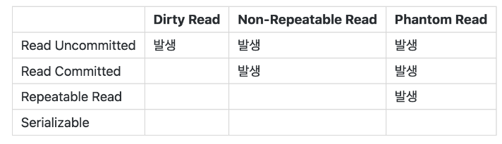

## 트랜잭션(transaction)이란?
트랜잭션(Transaction)은 데이터베이스의 상태를 변화시키기 위해 수행되는 작업의 단위를 의미한다.
https://shindonghyeo.github.io/db/2022-06-16-DB-%ED%8A%B8%EB%9E%9C%EC%9E%AD%EC%85%98(Transaction).html?h=%ED%8A%B8%EB%9E%9C%EC%9E%AD%EC%85%98

## 격리 수준(isolation level)이란?
나는 트랜잭션은 원자성이라는 특성으로 인해 중간에 다른 트랜잭션이 절대 접근하지 못한다고 생각했다. 하지만 원자성이란 단순히 트랜잭션 자체가 원자처럼 동작한다는 뜻이었다.(트랜잭션 속에 특정 로직은 반영되고 다른 로직은 반영되지 않은 채로 끝나지 않음. 모든 로직이 다같이 반영 or 반영되지 않음 처리 되어야 한다는 뜻)

결국 하나의 트랜잭션이 진행될 때 중간에 다른 트랜잭션이 접근할 수도 있고 이로 인해 예기치 못한 에러가 발생할 수 있다. 이를 관리하기 위해 사용하는 것이 격리 수준이다. 트랜잭션 실행 중 다른 트랜잭션의 접근 가능 정도를 의미한다고 보면 된다.

격리 수준은 가장 낮은 단계(접근 쉬움)부터 높은 단계(접근 어려움)까지 다음과 같다,

- READ UNCOMMITTED
- READ COMMITTED
- REPEATABLE READ
- SERIALIZABLE

격리 수준에 대해 자세히 알아보기 전에, 먼저 각 격리 단계에서 사용되는 락(Lock)에 대한 개념을 알아본다.

### 락(Lock)이란?

락은 데이터베이스의 동시성 제어를 위한 메커니즘으로 말 그대로 데이터의 작업을 막는(lock) 행위다. 가장 기본적인 락은 테이블의 row(행 데이터)에 적용되는 row-level lock이다. 해당 락의 종류는 2가지 존재한다,

- 공유 락(Shared Lock)

    : 읽기 허용. 추가/수정/삭제 불가.

- 배타 락(Exclusive Lock)

    : 추가/읽기/수정/삭제 불가.

<U>즉, 간단하게 트랜잭션은 시작할 때 lock을 걸고 commit 혹은 rollback이 되면 unlock되어 트랜잭션이 마무리된다.</U> 위 개념을 이용해 각 격리 수준에 대해 자세히 알아본다.

### 격리 수준 종류

일단 격리 수준에 대해 알아보기 전에 <U>데이터베이스 종류에 따라 내용이 조금씩 다르다</U>라는 점을 알고가자. 나는 `Mysql`의 `InnoDB`엔진을 사용한다는 것을 가정하고 설명한다.

#### READ UNCOMMITTED
- 사용 목적

    : 트랜잭션에 포함된 데이터베이스 작업들이 원자적으로 동작하게끔 보장하는 데 중점을 둠
- 예시 

    : 실시간 로그 수집(데이터 일관성보다는 빠른 처리 속도가 더 중요하기 때문에)

#### READ COMMITTED

#### REPEATABLE READ

#### SERIALIZABLE

## 정리

